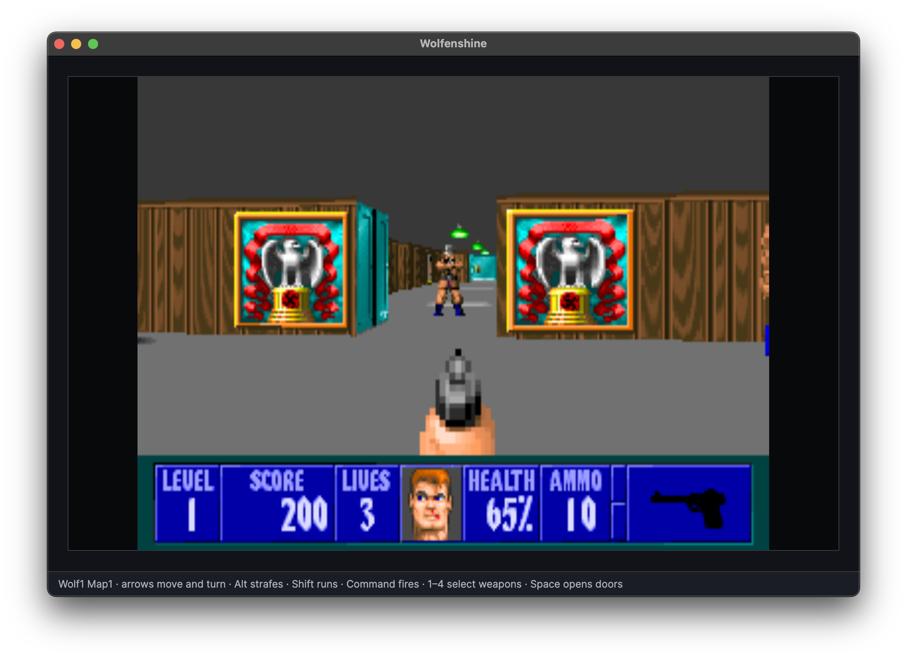
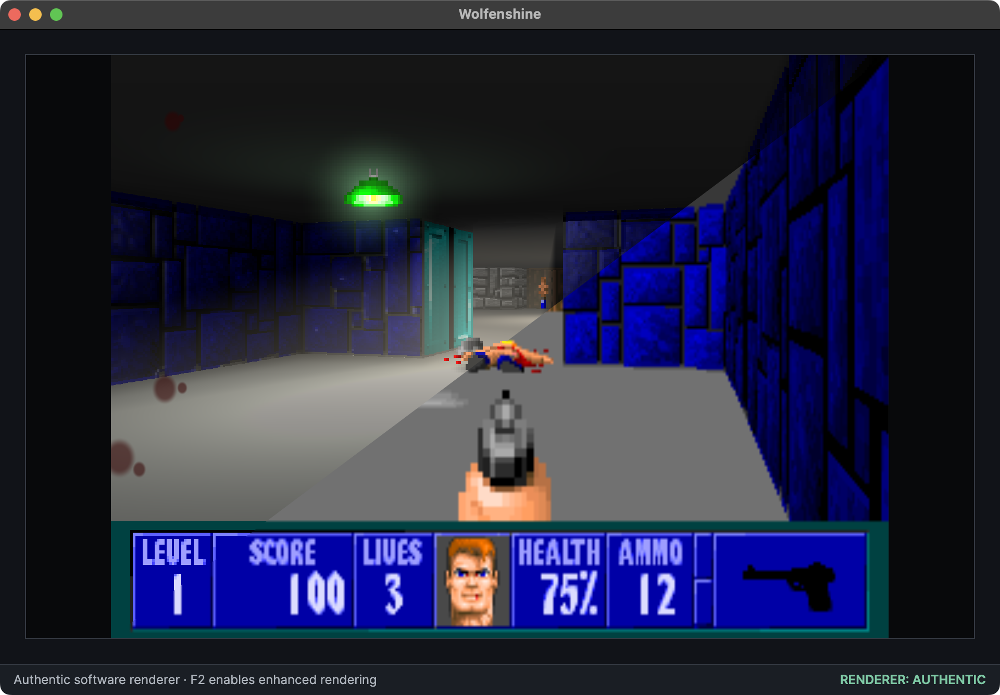
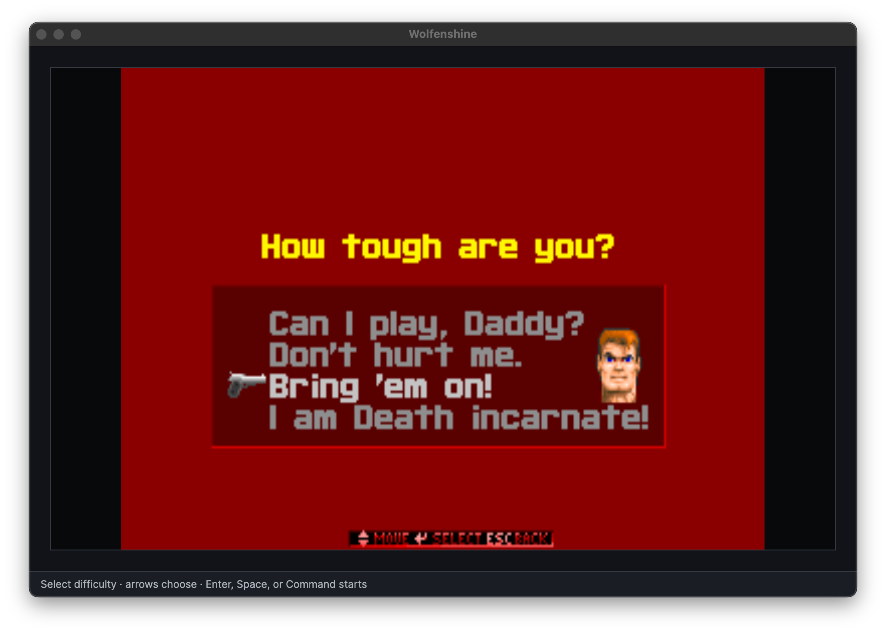
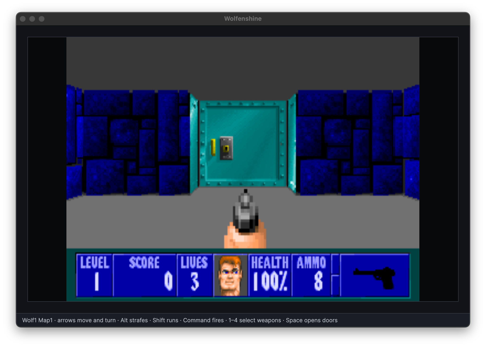

[](https://twitter.com/deanthecoder) [](https://github.com/deanthecoder/Wolfenshine/stargazers)

# Wolfenshine

A modern C# port of the original Wolfenstein 3D experience.

Wolfenshine rebuilds the complete game around a clean, cross-platform .NET codebase while loading the artwork, maps, music, and sounds from your own copy of Wolfenstein 3D. It currently includes the original-style difficulty menu, all six episodes, textured software rendering, enemies, weapons, pickups, doors, secret walls, elevators, sound, music, death and respawning, and end-of-level statistics.

The first goal is to reproduce how the 1992 game looks and plays. That gives us a trustworthy foundation for a later enhanced renderer with lighting, fog, shaders, and other modern effects—without losing the original version along the way.



### Authentic and enhanced rendering

Press F2 at any time during play to switch between the faithful software renderer and the experimental shader renderer. The comparison below shows enhanced distance shading on the left and the authentic presentation on the right.



The enhanced renderer also applies dynamic light to enemies. The example below shows a guard moving into and out of a ceiling light, with gunfire briefly illuminating both the enemy and the surrounding room.


## What works today

- All 60 maps from the six-episode edition load directly from the original data files.
- The 320×200 presentation retains the original 4:3 display proportions and indexed VGA artwork.
- Guards, officers, SS soldiers, mutants, and dogs see, hear, chase, attack, take damage, and die.
- Weapons, ammunition, health, treasure, keys, doors, pushwalls, elevators, death, and level progression work.
- Original digitized and AdLib effects are played spatially through OpenAL; original IMF music is rendered through OPL emulation.
- Difficulty affects enemy placement, health, behavior, and incoming damage in the same places it did originally.
- An authentic-looking difficulty screen, HUD, pause plaque, and intermission screen complete the experience.
- F2 switches live between authentic movement/software rendering and an experimental enhanced mode with momentum-based movement, view bob, dynamic lighting, distance shading, geometry-aware ambient occlusion, and room ambience derived from local light coverage.

Wolfenshine is still under development. Bosses, episode endings, save games, and some less common gameplay details remain to be implemented.



## Add the original game resources

Wolfenshine does not distribute Wolfenstein 3D's copyrighted game data. You need a legitimately obtained copy of the full six-episode edition, plus its original VGA palette.

Create this private, Git-ignored directory inside your checkout:

```text
local/game-data/
```

Copy these eight files from the installed game into it:

```text
AUDIOHED.WL6
AUDIOT.WL6
GAMEMAPS.WL6
MAPHEAD.WL6
VGADICT.WL6
VGAGRAPH.WL6
VGAHEAD.WL6
VSWAP.WL6
```

Then download [GAMEPAL.OBJ](https://github.com/id-Software/wolf3d/blob/master/WOLFSRC/OBJ/GAMEPAL.OBJ) from id Software's official source release and place that single file in the same directory:

```text
GAMEPAL.OBJ
```

`GAMEPAL.OBJ` supplies the original VGA palette used by the indexed game resources; no original C source or source checkout is needed. The build copies these private files into the application's output directory when they are present. If any are missing, Wolfenshine still builds and opens, then reports exactly which files it needs.

Only the full `.WL6` data set is supported at present. Shareware `.WL1` and data from other releases may follow later.

## Controls

| Action | Key                        |
|---|----------------------------|
| Move and turn | Arrow keys                 |
| Run | Shift                      |
| Strafe | Alt + Left/Right           |
| Use doors, switches, and secret walls | Space                      |
| Fire | Control / Command |
| Select an owned weapon | 1–4                        |
| Pause or resume | P                          |
| Toggle authentic/enhanced rendering | F2    |

## Build and run

Wolfenshine requires the .NET 8 SDK. Clone the repository and its submodules, add the resources above, then run it:

```shell
git clone --recurse-submodules https://github.com/deanthecoder/Wolfenshine.git
cd Wolfenshine
dotnet run --project Wolfenshine/Wolfenshine.csproj
```



## Why C#?

Wolfenstein 3D has many excellent source ports already, but rebuilding it in modern C# makes a particularly approachable playground for old-school rendering, binary file formats, game AI, audio emulation, and future shader experiments. The project deliberately favors clear components and testable behavior over a mechanical C-to-C# translation.

## Beyond the basics

Once the original game data, rendering, and core behavior are working, possible enhanced-mode experiments include:

- View bob and smoother camera motion.
- Damage feedback using edge-focused display blur and blood on the screen.
- Subtle peripheral motion blur while moving, strengthened while running.
- An optional LCD-screen shader for a stylized modern display treatment.
- Persistent enemy blood splats.
- Improved dynamic and colored lighting.
- Flickering lights in dungeon-like areas.
- Expanded ambient occlusion for added depth around sprites and other objects.
- Dynamic shadows.
- Spatial 3D sound.
- Optional hint HUD components, such as a floor-projected route to the nearest exit.
- A toggle that redirects the route hint toward the nearest unvisited treasure room.

These are ideas rather than compatibility requirements. A faithful rendering path should remain available alongside later visual and audio enhancements.

## Developer notes

### Relationship to the original source

id Software's [original Wolfenstein 3D source release](https://github.com/id-Software/wolf3d) is an invaluable historical and behavioral reference. Wolfenshine does not contain, compile, or require that C source. Its implementation is independently written in modern C#; we consult the released source to understand original gameplay rules and verify that Wolfenshine behaves similarly.

### Debug shortcuts

Debug builds provide a few development conveniences that are omitted from Release builds:

| Key | Action |
|---|---|
| `I` | Log the camera, weapon, doors, actors, sprite resolution, projection values, and nearby decorations. |
| `R` | Restore health and ammunition and unlock all weapons. |
| `M` | Toggle the textured map overview. |
| `S` | Save the current level, position, and direction as a quick test location. |
| `L` | Restart at the saved test location. |

### Wolfenstein 3D data files

The `.WL6` suffix identifies data for the full six-episode edition. The shareware episode uses `.WL1`; other releases use related suffixes and may arrange individual resources differently. Multi-byte values in the original data are little-endian.

| File | Purpose |
|---|---|
| `AUDIOHED.WL6` | An offset table locating audio chunks within `AUDIOT.WL6`. |
| `AUDIOT.WL6` | PC-speaker effects, AdLib effects, and music data. Digitized sound samples are stored in `VSWAP.WL6`. |
| `MAPHEAD.WL6` | Contains the RLEW compression tag and a table reserving 100 level-header offsets within `GAMEMAPS.WL6`. Wolfenstein 3D uses the first 60 slots; unused slots within that range contain `0xFFFFFFFF`. |
| `GAMEMAPS.WL6` | Contains the level headers and compressed map planes describing walls, objects, actors, and areas. Map planes use Carmack compression followed by RLEW compression. |
| `VGADICT.WL6` | The Huffman dictionary used to decompress chunks from `VGAGRAPH.WL6`. |
| `VGAHEAD.WL6` | A table of 24-bit offsets locating graphics chunks within `VGAGRAPH.WL6`. |
| `VGAGRAPH.WL6` | Huffman-compressed UI artwork, fonts, tiles, and other screen graphics. Chunk identifiers vary between game versions. |
| `VSWAP.WL6` | A page-oriented container holding wall textures, sprites, and digitized sound samples. |
| `GAMEPAL.OBJ` | A 16-bit OMF object containing the original 256-color VGA palette. |

`CONFIG.WL6` is generated configuration state rather than a required asset. `WOLF3D.EXE` is useful as a behavioral reference but is not loaded by Wolfenshine.

The current private development data is the full six-episode June 1992 v1.1 release. The released source tree defaults to the later `GOODTIMES` v1.4 configuration, so resource readers must avoid assuming that version-specific chunk identifiers are universal.

#### Map container layout

`MAPHEAD.WL6` begins with a 16-bit RLEW tag followed by 100 little-endian 32-bit offsets. Wolfenstein 3D reads the first 60 map slots; `0xFFFFFFFF` marks a sparse slot within that range.

Each offset locates a 38-byte map header in `GAMEMAPS.WL6`:

| Field | Size | Notes |
|---|---:|---|
| Plane offsets | 3 × 4 bytes | Absolute offsets within `GAMEMAPS.WL6`. |
| Plane lengths | 3 × 2 bytes | Compressed byte lengths. |
| Width and height | 2 × 2 bytes | The original Wolfenstein 3D maps are 64 × 64 tiles. |
| Name | 16 bytes | Null-terminated DOS ASCII. |

The game loads plane 0 (walls and areas) and plane 1 (actors, objects, and level information). Each plane starts with its Carmack-expanded byte length. Carmack expansion produces an RLEW stream whose first word is its final expanded byte length; expanding that stream produces `width × height` 16-bit tile values in row-major order.

#### Wall textures and palette

`VSWAP.WL6` begins with three 16-bit values: the total page count, the first sprite page, and the first digitized-sound page. These are followed by one 32-bit offset and one 16-bit length for every page. Pages before the sprite boundary are 64 × 64 wall textures stored as palette indices in column-major order.

Each ordinary wall tile selects a pair of pages: one for east/west-facing walls and one for north/south-facing walls. Door textures occupy the final eight pages of the wall region and similarly use orientation-specific pairs. Wall faces immediately inside a doorway use the dedicated `DOORWALL + 2/+3` jamb textures from that region.

Wolfenshine retains the textures as 8-bit palette indices. `GAMEPAL.OBJ` contains 256 RGB triplets using the VGA DAC's 0–63 channel range; these are expanded to 8-bit RGB values when the palette loads. The software renderer resolves each texture index through that palette while writing its reusable RGBA framebuffer. Keeping indexed textures as the canonical representation preserves the original data and leaves palette swaps or a future GPU palette lookup straightforward.

The E1M1 ceiling uses palette index `0x1D`; the original VGA clear routine uses `0x19` for the floor. Wolfenshine resolves both through the same loaded palette rather than approximating their RGB colors.

`VGADICT.WL6` contains the Huffman tree used to expand `VGAGRAPH.WL6`, while `VGAHEAD.WL6` supplies its 24-bit chunk offsets. Picture chunk zero expands to a width/height table. Wolfenshine identifies the 320×40 status bar from those dimensions instead of relying on a generated chunk number: it is chunk 95 in the current v1.1 data but chunk 86 in the later GOODTIMES source configuration. Pictures are stored in four VGA planes and converted to row-major palette indices after expansion.

Sprite pages use a column/post format. Each column lists its opaque vertical runs and their palette-index data, so transparency is structural rather than represented by a reserved color. The final 20 sprite pages before the sound boundary contain the four weapons' five animation frames; this allows weapon frames to be located without hard-coding version-specific absolute sprite numbers.

## License

Licensed under the MIT License. See [LICENSE](LICENSE) for details.

### Third-party libraries

Wolfenshine uses [NukedOPL3Sharp](https://github.com/codengine/NukedOPL3Sharp) by Stefan Hueg, a C# port of nukeykt's Nuked-OPL3 emulator, to render the original AdLib sound effects and IMF music. NukedOPL3Sharp is distributed under the [GNU Lesser General Public License 2.1](https://github.com/codengine/NukedOPL3Sharp/blob/master/LICENSE); that license applies to the library rather than Wolfenshine's MIT-licensed code.
