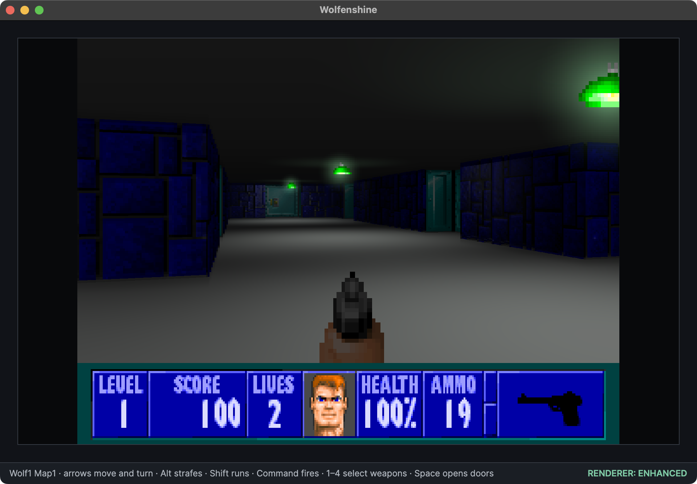
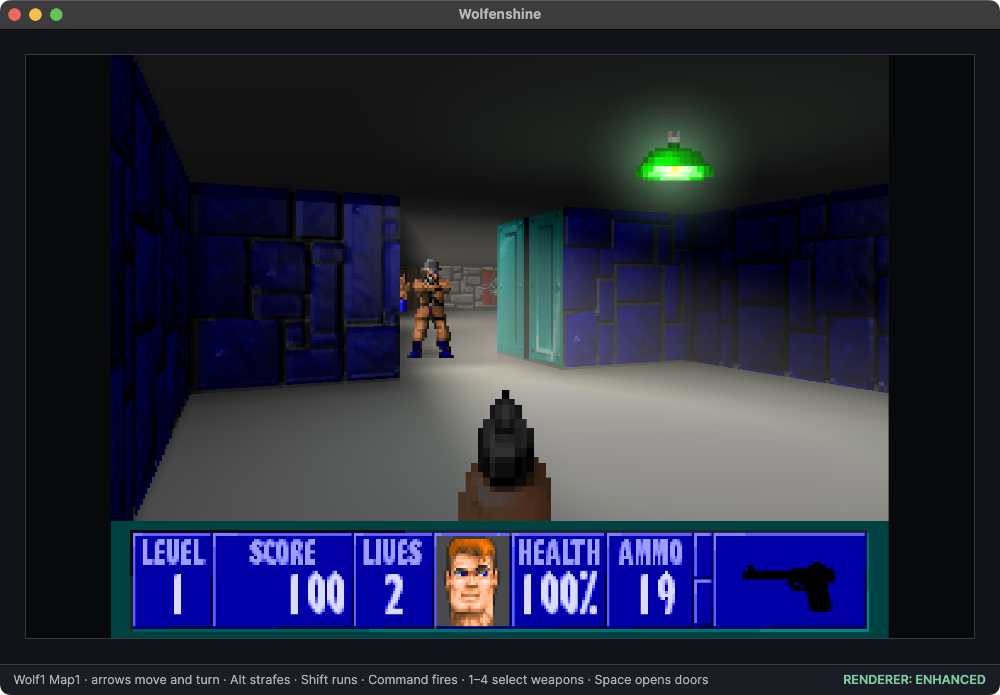
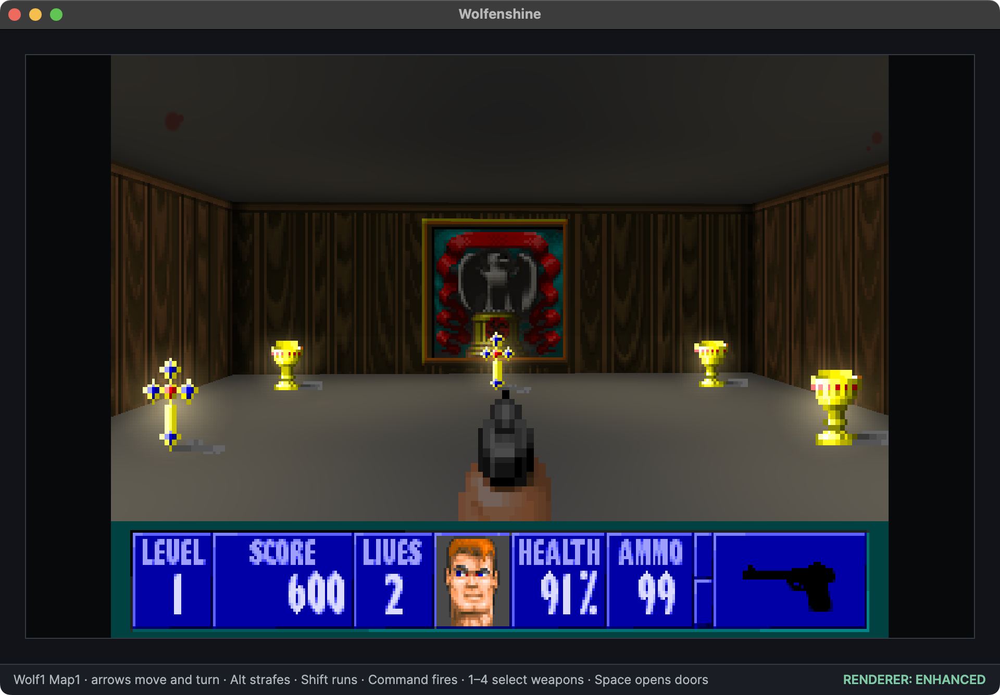
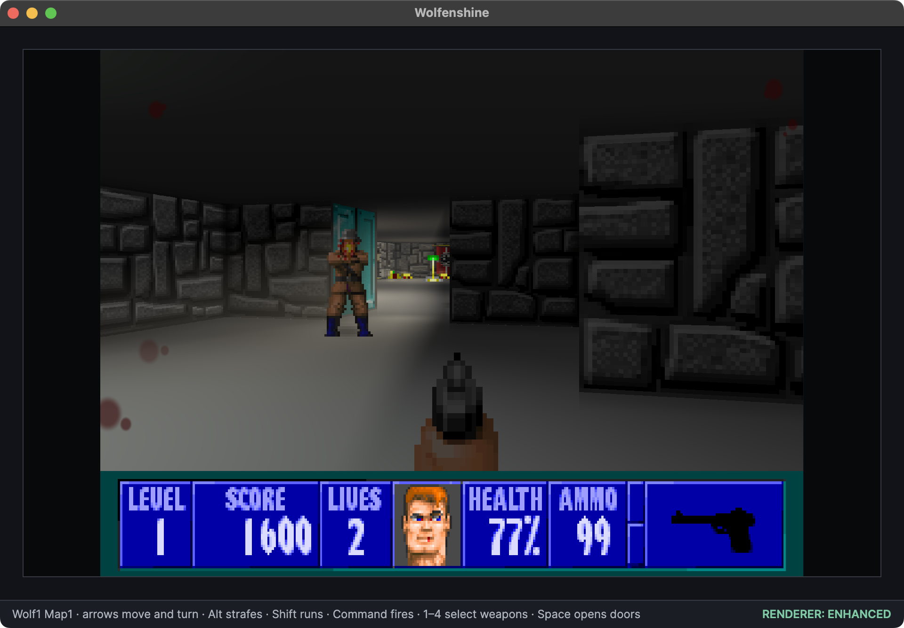
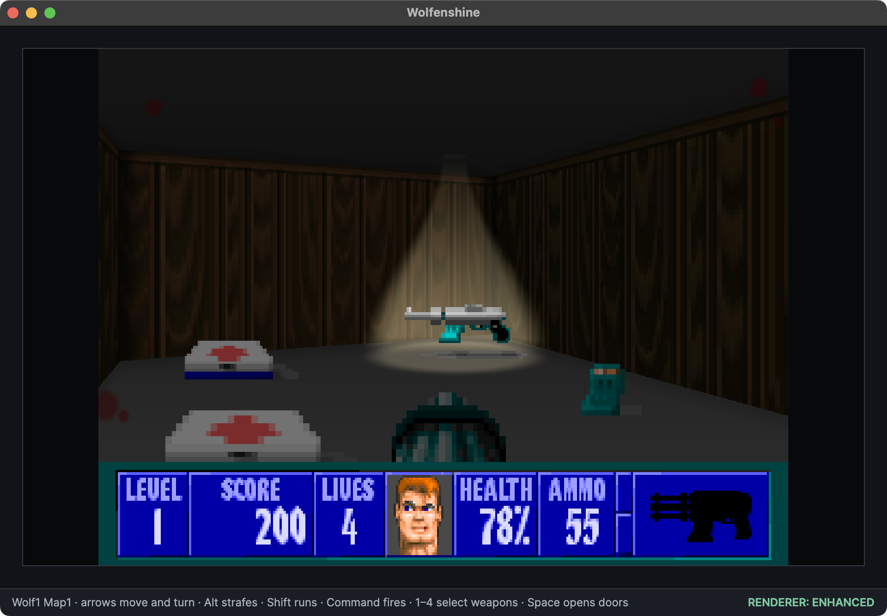
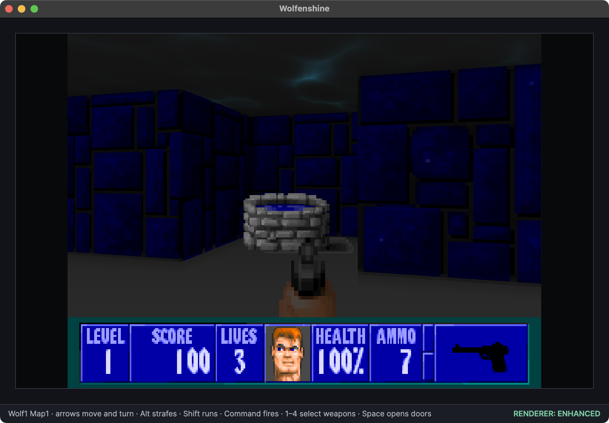
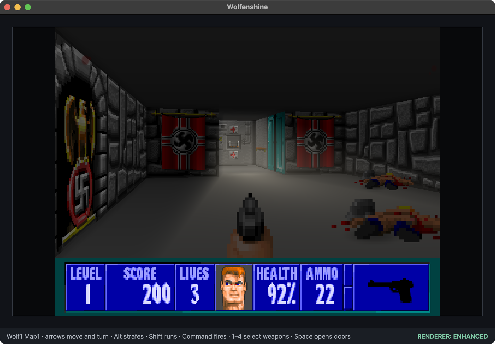
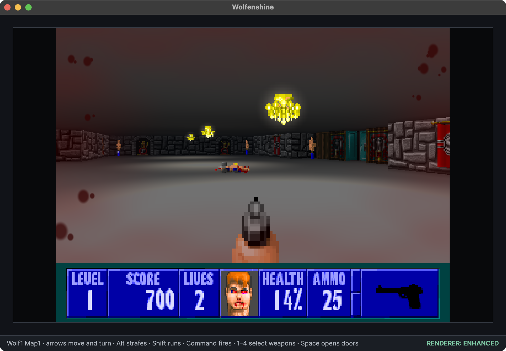
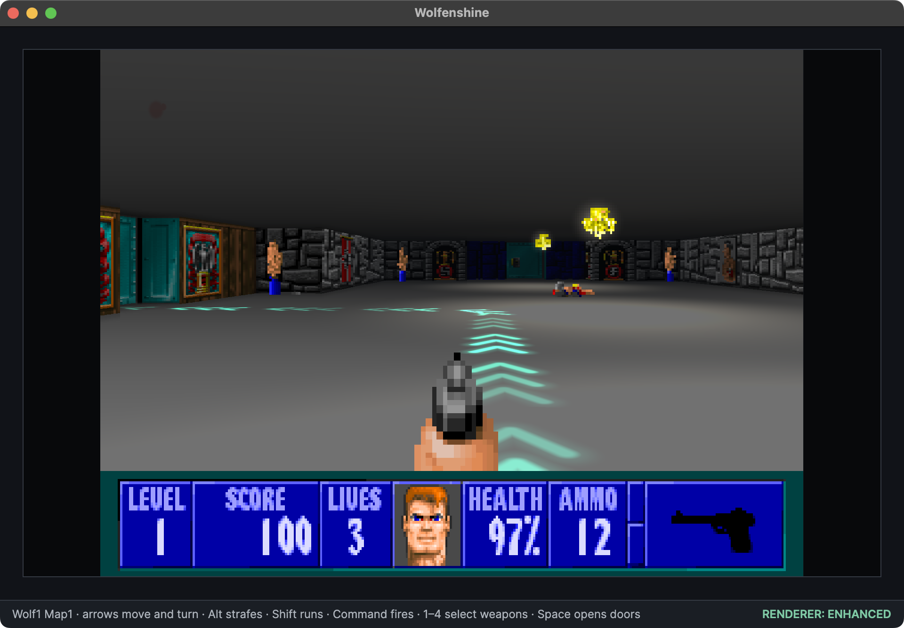

[](https://twitter.com/deanthecoder) [](https://github.com/deanthecoder/Wolfenshine/stargazers)

# Wolfenshine

**Wolfenstein 3D rebuilt in modern C#—faithful when you want it, shiny when you don't.**

Wolfenshine is a playable, cross-platform reimplementation of the 1992 classic. It reads the maps, artwork, music, and sounds from your own copy of Wolfenstein 3D, then brings them to life through a clean .NET engine written from scratch.

At its heart is an authentic 320×200 software-rendered experience. Press F2 and that same game becomes something new: colored lights spill across rooms, muzzle flashes illuminate enemies, fog gathers in the distance, and bright doorways cast descending shafts into the darkness.


## Then press F2

The enhanced renderer builds on that classic foundation without replacing its pixel art. Rooms gain their own atmosphere: lights cast color, treasure glows, enemies move through illumination, and damage changes the character of the whole screen.

<table>
  <tr>
    <td></td>
    <td></td>
  </tr>
  <tr>
    <td></td>
    <td></td>
  </tr>
  <tr>
    <td></td>
    <td></td>
  </tr>
  <tr>
    <td></td>
    <td></td>
  </tr>
</table>

## Classic underneath. Modern light on top.

Wolfenshine keeps the original-style renderer and enhanced renderer side by side. Switch between them instantly during play; the world, AI, input, and game state never change underneath you.


### Authentic mode

- Original 320×200 composition presented at the correct 4:3 aspect ratio.
- Indexed VGA artwork and palette-driven wall textures.
- Familiar movement, weapon animation, HUD, menus, pause plaque, and intermission screen.
- A reusable C# software framebuffer with the classic raycast presentation intact.

### Enhanced mode

- True 16:10 gameplay expands the horizontal view without stretching the original artwork; wider monitors use black side bars.
- Colored, directional ceiling lights, chandeliers, lamps, treasure glow, and muzzle flashes.
- Atmospheric doorway shafts that descend from bright rooms into darker ones, illuminate objects, and fade naturally with the viewing direction.
- Focused overhead spotlights draw attention to uncollected weapons, keys, and full-heal pickups.
- Filled wells and puddles project animated ceiling caustics, using an algorithm adapted from [Kali's Shadertoy shader](https://www.shadertoy.com/view/XtKfRG).
- Geometry-aware room ambience, doorway light spill, distance shading, and subtle fog.
- Generated wall relief with material-specific specular response.
- Bloom, ambient occlusion, enemy shadows, view bob, weapon sway, and momentum-based movement.
- Dynamic enemy illumination plus directional damage tint and accumulating blood at the screen edges.

The original pixel art remains at the center of the presentation. Enhanced effects respond to it rather than replacing it with a different asset pack.


## A path through the castle

Hold `Tab` in enhanced mode and Wolfenshine projects a flowing trail directly onto the floor. Three luminous chevrons cross each tile, bend smoothly around corners, and fade away when the key is released.



The guide follows gameplay rules rather than drawing a straight line through the map. It first leads to the nearest obtainable gold or silver key, allowing ordinary doors while respecting locks. Once no reachable key remains, it continues to the elevator. Unopened secret walls remain secret; moving one can reveal a newly valid route.

Because the trail is part of the rendered world, walls and doors hide what lies beyond them naturally. The route updates as the player moves, collects keys, opens passages, or shifts secret walls.

## More than a rendering demo

Wolfenshine includes the game systems that make the renderer worth exploring:

- All 60 maps from the six-episode edition load directly from the original data.
- Guards, officers, SS soldiers, mutants, and dogs see, hear, chase, attack, take damage, animate, and die.
- Four weapons, ammunition, health, treasure, keys, scoring, pickups, and enemy drops.
- Sliding and locked doors, secret pushwalls, elevators, death, respawning, level progression, and end-of-level statistics.
- Difficulty-dependent enemy placement, health, behavior, and incoming damage.
- Spatial digitized and AdLib sound through OpenAL, plus original IMF music rendered through OPL emulation.
- Original-style difficulty selection, HUD, animated face, pause display, and intermission presentation.


## Play Wolfenshine

You need the [.NET 8 SDK](https://dotnet.microsoft.com/download/dotnet/8.0) and either the free Wolfenstein 3D shareware data or a legitimate copy of the full six-episode game. Wolfenshine does not distribute id Software's copyrighted game assets.

Clone the repository and its submodules:

```shell
git clone --recurse-submodules https://github.com/deanthecoder/Wolfenshine.git
cd Wolfenshine
```

### Quick setup with the free shareware episode

The repository contains a ready-made, Git-ignored location for your private game data:

```text
local/game-data/
```

1. [Download `w3d-box.zip` from DOS Games Archive](https://www.dosgamesarchive.com/file/wolfenstein-3d/w3d-box) by clicking **Start download of 'w3d-box.zip'** on that page.
2. Keep the archive intact: do not rename or extract it.
3. Copy `w3d-box.zip` into `local/game-data/`.
4. From the repository root, run:

```bash
dotnet run --project Wolfenshine/Wolfenshine.csproj
```

The build finds the archive and extracts the eight required `.WL1` files automatically. There is no installer and no asset-conversion step.

The shareware edition contains the complete first episode: eight regular levels, its boss level, and its secret level. Nothing from the ZIP is committed to this repository.

### Use the full six-episode game

To play all six episodes, copy these eight files from an installed full game into `local/game-data/`:

```text
AUDIOHED.WL6
AUDIOT.WL6
GAMEMAPS.WL6
MAPHEAD.WL6
VGADICT.WL6
VGAGRAPH.WL6
VGAHEAD.WL6
VSWAP.WL6
```

The original VGA palette is built into Wolfenshine, so no palette or executable file is required. Loose `.WL1` shareware files are also accepted if you already have them extracted. When both complete editions are present, Wolfenshine prefers the full `.WL6` data set. If anything is missing, the app opens with a clear list of the files it still needs.

Wolfenshine supports the original `.WL1` shareware and `.WL6` full-game data sets.

### Run it

```shell
dotnet run --project Wolfenshine/Wolfenshine.csproj
```


### Controls

| Action | Key |
|---|---|
| Move and turn | Arrow keys |
| Run | Shift |
| Strafe | Alt + Left/Right |
| Use doors, switches, and secret walls | Space |
| Fire | Control / Command |
| Select an owned weapon | 1–4 |
| Pause or resume | P |
| Toggle authentic/enhanced rendering | F2 |
| Toggle FPS counter | F3 |
| Toggle fullscreen | Alt/Option+Enter; F11 on Windows/Linux; Escape leaves fullscreen |
| Show navigation guide | Hold Tab |

## Why build Wolfenstein 3D again?

Because the original game is an unusually good laboratory.

Its compact grid world is understandable enough to rebuild, yet rich enough to explore raycasting, binary formats, sprite projection, game AI, spatial audio, OPL emulation, software rendering, and modern shader effects in one coherent project. C# makes those systems approachable without turning Wolfenshine into a mechanical line-for-line translation of 1990s C.

The result is both a game and a guided tour through how one of PC gaming's foundations works.

## Developer notes

### Relationship to the original source

id Software's [original Wolfenstein 3D source release](https://github.com/id-Software/wolf3d) is an invaluable historical and behavioral reference. Wolfenshine does not contain, compile, or require that C source. Its implementation is independently written in modern C#; we consult the released source to understand original gameplay rules and verify that Wolfenshine behaves similarly.

### Debug shortcuts

Debug builds provide a few development conveniences that are omitted from Release builds:

| Key | Action |
|---|---|
| `I` | Log the player's position and facing angle, weapon, doors, actors, sprite resolution, projection values, and nearby decorations. |
| `C` | On macOS, save a timestamped screenshot of the current window to `~/Downloads`. |
| `Shift+C` | Capture authentic and enhanced frames and rebuild `img/renderer-comparison.png` with a diagonal split. |
| `R` | Restore health and ammunition and unlock all weapons. |
| `M` | Toggle the textured map overview. |
| `S` | Save the current level, position, and direction as a quick test location. |
| `L` | Restart at the saved test location. |
| `<` / `>` | Restart at the previous or next level, wrapping at either end of the available maps. |

The Shift+C comparison capture keeps its clean source images in the Git-ignored `local/screenshots/` directory and overwrites the tracked README comparison image only after both renderer captures succeed.

### Wolfenstein 3D data files

The `.WL6` suffix identifies data for the full six-episode edition. The shareware episode uses `.WL1`; other releases use related suffixes and may arrange individual resources differently. Wolfenshine detects a complete WL6 or WL1 set and prefers WL6 when both are available. Multi-byte values in the original data are little-endian.

| File | Purpose |
|---|---|
| `AUDIOHED.WL6` | An offset table locating audio chunks within `AUDIOT.WL6`. |
| `AUDIOT.WL6` | PC-speaker effects, AdLib effects, and music data. Digitized sound samples are stored in `VSWAP.WL6`. |
| `MAPHEAD.WL6` | Contains the RLEW compression tag and a table reserving 100 level-header offsets within `GAMEMAPS.WL6`. Wolfenstein 3D uses the first 60 slots; unused slots within that range contain `0xFFFFFFFF`. |
| `GAMEMAPS.WL6` | Contains the level headers and compressed map planes describing walls, objects, actors, and areas. Map planes use Carmack compression followed by RLEW compression. |
| `VGADICT.WL6` | The Huffman dictionary used to decompress chunks from `VGAGRAPH.WL6`. |
| `VGAHEAD.WL6` | A table of 24-bit offsets locating graphics chunks within `VGAGRAPH.WL6`. |
| `VGAGRAPH.WL6` | Huffman-compressed UI artwork, fonts, tiles, and other screen graphics. Chunk identifiers vary between game versions. |
| `VSWAP.WL6` | A page-oriented container holding wall textures, sprites, and digitized sound samples. |

`CONFIG.WL6` is generated configuration state rather than a required asset. `WOLF3D.EXE` is useful as a behavioral reference but is not loaded by Wolfenshine.

The current private development data is the full six-episode June 1992 v1.1 release. The released source tree defaults to the later `GOODTIMES` v1.4 configuration, so resource readers must avoid assuming that version-specific chunk identifiers are universal.

#### Map container layout

`MAPHEAD.WL6` begins with a 16-bit RLEW tag followed by 100 little-endian 32-bit offsets. The full edition reads the first 60 map slots, while shareware reserves only its first 10; `0xFFFFFFFF` marks a sparse slot within the active range.

Each offset locates a 38-byte map header in `GAMEMAPS.WL6`:

| Field | Size | Notes |
|---|---:|---|
| Plane offsets | 3 × 4 bytes | Absolute offsets within `GAMEMAPS.WL6`. |
| Plane lengths | 3 × 2 bytes | Compressed byte lengths. |
| Width and height | 2 × 2 bytes | The original Wolfenstein 3D maps are 64 × 64 tiles. |
| Name | 16 bytes | Null-terminated DOS ASCII. |

The game loads plane 0 (walls and areas) and plane 1 (actors, objects, and level information). Each plane starts with its Carmack-expanded byte length. Carmack expansion produces an RLEW stream whose first word is its final expanded byte length; expanding that stream produces `width × height` 16-bit tile values in row-major order.

#### Wall textures and palette

`VSWAP.WL6` and `VSWAP.WL1` begin with three 16-bit values: the total page count, the first sprite page, and the first digitized-sound page. These are followed by one 32-bit offset and one 16-bit length for every page. Shareware retains the full page numbering but leaves unused later-game pages empty, so Wolfenshine decodes sparse pages only when present. Pages before the sprite boundary are 64 × 64 wall textures stored as palette indices in column-major order.

Each ordinary wall tile selects a pair of pages: one for east/west-facing walls and one for north/south-facing walls. Door textures occupy the final eight pages of the wall region and similarly use orientation-specific pairs. Wall faces immediately inside a doorway use the dedicated `DOORWALL + 2/+3` jamb textures from that region.

Wolfenshine retains the textures as 8-bit palette indices. The original 256 RGB triplets are embedded in the engine using the VGA DAC's 0–63 channel range and expanded to 8-bit RGB values when the palette loads. The software renderer resolves each texture index through that palette while writing its reusable RGBA framebuffer. Keeping indexed textures as the canonical representation preserves the original data and leaves palette swaps or a future GPU palette lookup straightforward.

The E1M1 ceiling uses palette index `0x1D`; the original VGA clear routine uses `0x19` for the floor. Wolfenshine resolves both through the same embedded palette rather than approximating their RGB colors.

`VGADICT.WL6` contains the Huffman tree used to expand `VGAGRAPH.WL6`, while `VGAHEAD.WL6` supplies its 24-bit chunk offsets. Picture chunk zero expands to a width/height table. Wolfenshine identifies the 320×40 status bar from those dimensions instead of relying on a generated chunk number: it is chunk 95 in the current v1.1 data but chunk 86 in the later GOODTIMES source configuration. Pictures are stored in four VGA planes and converted to row-major palette indices after expansion.

Sprite pages use a column/post format. Each column lists its opaque vertical runs and their palette-index data, so transparency is structural rather than represented by a reserved color. The final 20 sprite pages before the sound boundary contain the four weapons' five animation frames; this allows weapon frames to be located without hard-coding version-specific absolute sprite numbers.

## License

Licensed under the MIT License. See [LICENSE](LICENSE) for details.

### Third-party libraries

Wolfenshine uses [NukedOPL3Sharp](https://github.com/codengine/NukedOPL3Sharp) by Stefan Hueg, a C# port of nukeykt's Nuked-OPL3 emulator, to render the original AdLib sound effects and IMF music. NukedOPL3Sharp is distributed under the [GNU Lesser General Public License 2.1](https://github.com/codengine/NukedOPL3Sharp/blob/master/LICENSE); that license applies to the library rather than Wolfenshine's MIT-licensed code.
